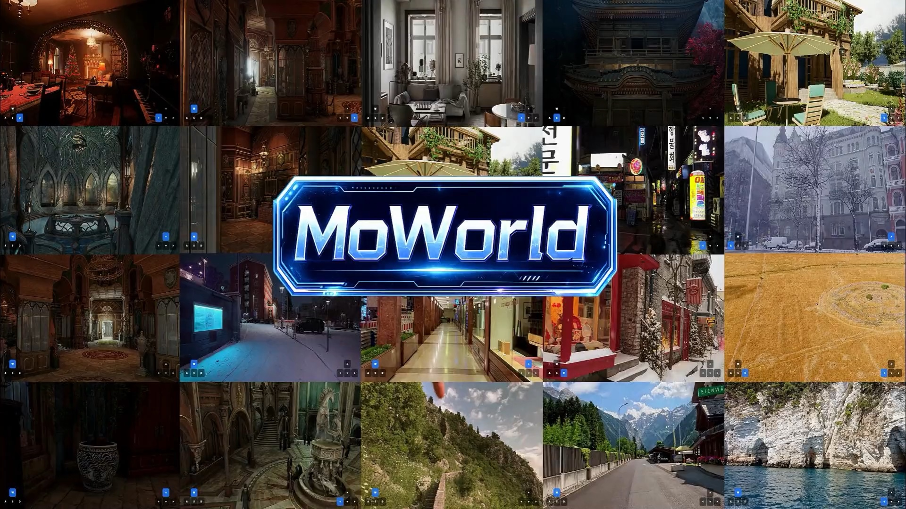

<div align="center">



<h1>MoWorld: A Flash World Model</h1>

Team Moxin

[](https://moxin-tech.github.io/moworld/)
[](https://arxiv.org/abs/2607.06216)
[](https://github.com/Moxin-Tech/moworld_base)
[](LICENSE)

</div>

https://github.com/user-attachments/assets/57cfb64f-4103-4070-834c-1801c277e329

---

We present **MoWorld**, a cost-efficient, high-performance Flash World Model for real-time interactive video generation on Neural Processing Units (NPUs). MoWorld jointly optimizes data, algorithms, systems, and hardware across an end-to-end pipeline spanning data generation and pretraining.

- **3D-Native Data Engine**: A scalable data pipeline constructs geometrically consistent training samples from real-world and synthetic environments through geometry completion, quality control, trajectory verification, and vision-language annotation.
- **Curriculum Cross-Frame Pretraining**: Training progressively extends from short clips to sequences of up to 2,000 frames, improving camera control, temporal consistency, and long-horizon spatial memory.
- **Few-Step Autoregressive Generation**: Autoregressive flow-matching pretraining and Self-Forcing distillation reduce the standard 50-step sampling process to 4-step generation.
- **Real-Time NPU Inference**: Pipeline-, parallelism-, and kernel-level optimizations enable up to 50 FPS on NPUs in the configuration reported in the paper, with an average inference cost reported at 30%–50% of existing world-model solutions.

Given a first frame, a text prompt, and camera controls, it generates long-horizon video while preserving visual quality, spatial consistency, and control responsiveness. Visit the [project page](https://moxin-tech.github.io/moworld/) to explore more world-generation, reconstruction, and downstream application results.


## 🔥 News

- Sep., 2026: We open source MoWorld and will continue to release subsequent versions of MoWorld.
- Jul. 17–20, 2026: MoWorld debuts and exhibits at the [World Artificial Intelligence Conference (WAIC 2026)](https://english.shanghai.gov.cn/en-Events/20260624/9cc202d708504b56ba32f70fbd61ef79.html) in Shanghai.
- Jul. 7, 2026: We released the first version of the MoWorld technical report at [arXiv](https://arxiv.org/abs/2607.06216).

## ⚙️ Quick Start

Prepare a Linux environment with Python 3.10+, PyTorch 2.7.1, and compatible CANN and `torch_npu` packages; see the [setup guide](USAGE.md#installation).

### Installation

Clone the repository:

```bash
git clone --recursive https://github.com/Moxin-Tech/moworld_base.git
cd moworld_base
export MOWORLD_ROOT="$PWD"
```

Install dependencies in your Ascend environment:

```bash
python -m pip install -e ./MindSpeed
git clone --branch core_v0.12.1 https://github.com/NVIDIA/Megatron-LM.git ../Megatron-LM
export PYTHONPATH="$(cd ../Megatron-LM && pwd):${PYTHONPATH:-}"
python -m pip install -e ./moworld
```

Download the [MoWorld Checkpoint](https://huggingface.co/moworld1/moworld_base):

```bash
python -m pip install huggingface_hub
export MOWORLD_WEIGHTS="$MOWORLD_ROOT/models/moworld"
hf download "moworld1/moworld_base" --local-dir "$MOWORLD_WEIGHTS"
```

Prepare your training data and any required tokenizer/encoder assets following the [asset layout](USAGE.md#model-assets), then run the commands below from `moworld/`:

```bash
export MODEL_PATH="$MOWORLD_ROOT/models/base"
export MINDSPEED_PATH="$MOWORLD_ROOT/MindSpeed"
cd "$MOWORLD_ROOT/moworld"
```

### Training

Prepare your feature data and `examples/moworld/local_data/train_data.json` using the [data preparation guide](USAGE.md#prepare-feature-data). The published checkpoint contains the high-noise expert only. Link it into the converter's expected layout, convert it to DCP, then train the high-noise expert:

```bash
mkdir -p "$MODEL_PATH/high_noise_model"
ln -s "$MOWORLD_WEIGHTS/high_noise_model.safetensors" \
  "$MODEL_PATH/high_noise_model/diffusion_pytorch_model.safetensors"
EXPERTS=high_noise_model SOURCE_ROOT="$MODEL_PATH" \
bash examples/moworld/convert_weights.sh

export MM_DATA="$PWD/examples/moworld/local_data/train_data.json"
export TRAIN_ITERS=10 SAVE_INTERVAL=10
bash examples/moworld/pretrain_high.sh
```

This is a short pretraining run on 16 NPUs. Checkpoints are saved under `checkpoints/train/high_noise_model/`. See the [training guide](USAGE.md#training) for configuration.

## 💡 Highlights

https://github.com/user-attachments/assets/be71859e-8075-4c04-bbab-068b33cb16a9

https://github.com/user-attachments/assets/de0d19e8-e07e-4f31-b80a-791b816132a3

https://github.com/user-attachments/assets/26d2b766-b78c-44fa-b575-9d992d3009a6

https://github.com/user-attachments/assets/410699b7-87e5-480a-a389-66046d1a7123

https://github.com/user-attachments/assets/a65b5e92-a1fe-450e-bbec-223ba6f759ed

https://github.com/user-attachments/assets/afe39bd1-59b7-4b8b-9110-8cc726b26dfe


## 🌍 Applications

MoWorld provides a unified generative world representation for a range of downstream applications:

- camera-controllable video generation and style transfer;
- video editing and cinematic previsualization;
- point-cloud and 3D Gaussian Splatting reconstruction;
- interactive navigation and embodied intelligence;
- real-estate visualization, cloud gaming, and digital twins.

## 📜 License

The original MoWorld content in this repository is licensed under the [Creative Commons Attribution-NonCommercial 4.0 International License](LICENSE) (**CC BY-NC 4.0**).

You may use, share, and adapt the licensed material for non-commercial purposes with appropriate attribution. Commercial use requires separate permission from Team Moxin. Third-party components remain subject to their original licenses and usage terms.

## 📖 Citation

If you find this work useful for your research, please cite our paper:

```bibtex
@article{moworld2026,
  title   = {MoWorld: A Flash World Model},
  author  = {{Team Moxin} and Deyi Ji and Tianrun Chen and Xin Zhang and Jiale Yang and Qi Zhu and An Zhao and Zihao Xie and Han Wang and Xuanyi Liu and Yixiang Zhou and Pei Liu and Yi Tan and Cheng Chen and Dayi Zhu and Mingyu Wei and Hanjie Xu and Jun Liao and Siqi Li and Lingyu Lu and Hongye Fang and Hongming Tan and Youjiang Zhu and Taiyu Zhang and Zejian Li and Chaotao Ding and Zhipeng Liang and Wenxuan Song and Yi Li and Baochuan Yang and Xin Jiang and Ben Feng and Jingyuan Zou and Yanlin Liu and Rong Shi and Lingfeng Li and Liyi Yao and Lanyun Zhu and Yunhe Pan and Lingyun Sun},
  journal = {arXiv preprint arXiv:2607.06216},
  year    = {2026}
}
```
